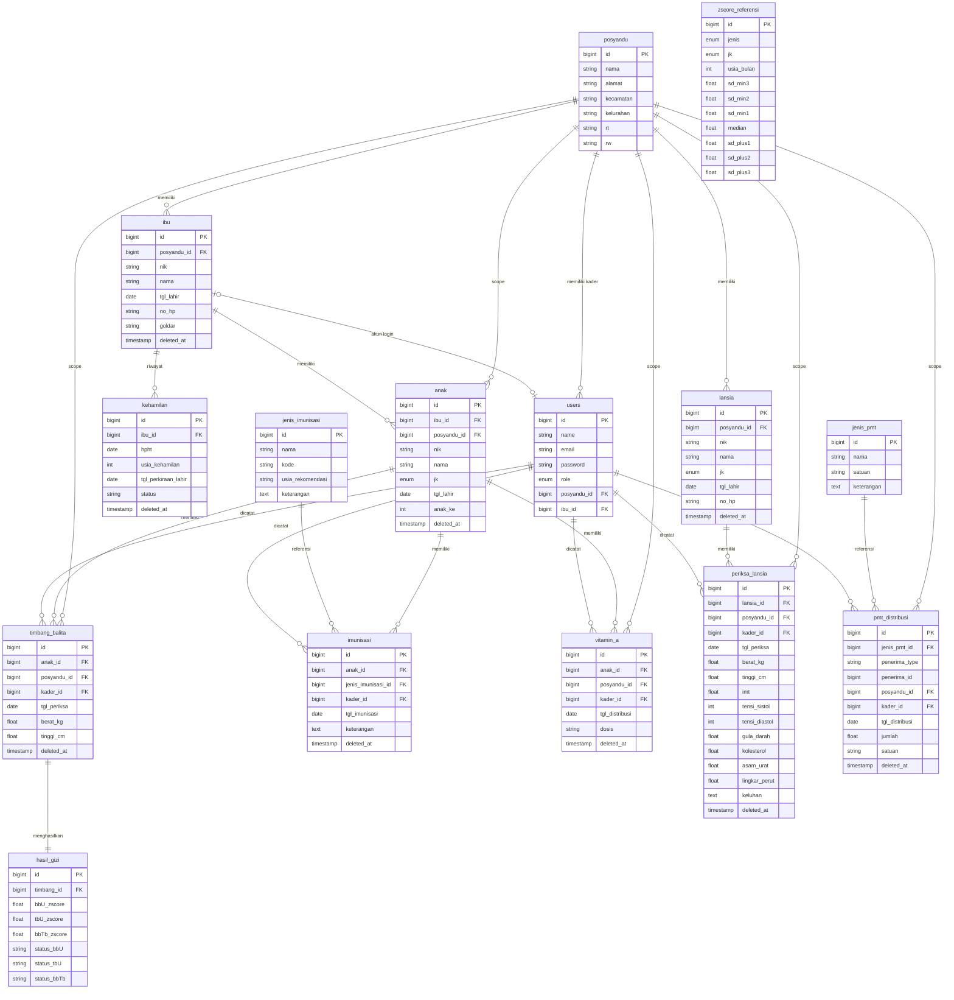

# ERD — Sistem Informasi Posyandu

> **15 tabel** | Laravel 10 + MySQL | Soft delete semua tabel transaksi
> Disusun oleh: Moh. Yusuf Hidayatulloh | Kediri, 2025

---

## Diagram ERD



---

## Pengelompokan Tabel

### 🔵 Master Data (6 tabel)

| Tabel | Deskripsi |
|---|---|
| `posyandu` | Data cabang/posyandu dalam 1 desa. Root dari semua data. |
| `users` | Semua user sistem — admin_desa, kader, orang_tua. Role disimpan sebagai enum. |
| `ibu` | Master data ibu. Bisa punya akun login (role orang_tua) via `ibu_id` di tabel users. |
| `kehamilan` | Riwayat kehamilan ibu. Dipisah karena 1 ibu bisa hamil berkali-kali. |
| `anak` | Master data anak, berelasi ke ibu dan posyandu. |
| `lansia` | Master data lansia per posyandu. |

### 🟢 Lookup Table (2 tabel)

| Tabel | Deskripsi |
|---|---|
| `jenis_imunisasi` | Master jenis imunisasi: BCG, Polio, DPT, Campak, dll. Diisi via seeder. |
| `jenis_pmt` | Master jenis PMT yang didistribusikan. Diisi via seeder. |

### 🟠 Referensi (1 tabel)

| Tabel | Deskripsi |
|---|---|
| `zscore_referensi` | Tabel standar WHO/Kemenkes untuk kalkulasi z-score. ±3.000 rows, diisi via seeder dari file resmi Kemenkes. Dipakai oleh `ZScoreCalculator` service saat input timbang. |

### 🔴 Transaksi (6 tabel)

| Tabel | Deskripsi |
|---|---|
| `timbang_balita` | Input penimbangan balita: BB + TB + tanggal per kunjungan. |
| `hasil_gizi` | Hasil kalkulasi z-score dari timbang_balita. Relasi 1:1. Disimpan agar laporan & grafik KMS cepat tanpa hitung ulang. |
| `imunisasi` | Pencatatan imunisasi per anak per jenis. |
| `vitamin_a` | Pencatatan distribusi Vitamin A per anak (2x setahun). |
| `periksa_lansia` | Pemeriksaan lansia: 9 field vital sign + kalkulasi IMT otomatis. |
| `pmt_distribusi` | Distribusi PMT ke balita/ibu hamil/lansia via polymorphic relation. |

---

## Detail Relasi

### Relasi Kritis

| Dari | Ke | Tipe | Keterangan |
|---|---|---|---|
| `posyandu` | `users` | 1:N | Kader terikat 1 posyandu (`posyandu_id` di users) |
| `posyandu` | `ibu`, `anak`, `lansia` | 1:N | Semua data master terikat ke posyandu |
| `ibu` | `users` | 0/1 : 0/1 | Ibu bisa punya akun login orang_tua, tapi tidak wajib |
| `ibu` | `kehamilan` | 1:N | 1 ibu bisa punya banyak riwayat kehamilan |
| `ibu` | `anak` | 1:N | 1 ibu bisa punya banyak anak |
| `timbang_balita` | `hasil_gizi` | 1:1 | Setiap penimbangan menghasilkan tepat 1 record z-score |
| `users` | semua tabel transaksi | 1:N | Semua transaksi mencatat `kader_id` siapa yang input |

### Polymorphic Relation — `pmt_distribusi`

Kolom `penerima_type` + `penerima_id` tidak punya FK di database, tapi dihandle di level aplikasi (Laravel Eloquent morphTo):

| `penerima_type` | `penerima_id` merujuk ke |
|---|---|
| `App\Models\Anak` | `anak.id` |
| `App\Models\Ibu` | `ibu.id` (saat status hamil) |
| `App\Models\Lansia` | `lansia.id` |

---

## Catatan Teknis

### Enum Values

| Tabel | Kolom | Values |
|---|---|---|
| `users` | `role` | `admin_desa`, `kader`, `orang_tua` |
| `anak` | `jk` | `L`, `P` |
| `lansia` | `jk` | `L`, `P` |
| `zscore_referensi` | `jenis` | `BB/U`, `TB/U`, `BB/TB` |
| `zscore_referensi` | `jk` | `L`, `P` |

### Soft Delete

Semua tabel transaksi dan master data menggunakan `deleted_at` (Laravel `SoftDeletes` trait):

`ibu`, `kehamilan`, `anak`, `lansia`, `timbang_balita`, `imunisasi`, `vitamin_a`, `periksa_lansia`, `pmt_distribusi`

Tabel lookup (`jenis_imunisasi`, `jenis_pmt`) dan referensi (`zscore_referensi`) **tidak** perlu soft delete.

### Migration Order

Urutan migration wajib diikuti karena FK dependency:

```
1. posyandu
2. jenis_imunisasi
3. jenis_pmt
4. zscore_referensi
5. users          ← FK ke posyandu
6. ibu            ← FK ke posyandu
7. kehamilan      ← FK ke ibu
8. anak           ← FK ke ibu, posyandu
9. lansia         ← FK ke posyandu
10. timbang_balita ← FK ke anak, posyandu, users
11. hasil_gizi     ← FK ke timbang_balita
12. imunisasi      ← FK ke anak, jenis_imunisasi, users
13. vitamin_a      ← FK ke anak, posyandu, users
14. periksa_lansia ← FK ke lansia, posyandu, users
15. pmt_distribusi ← FK ke jenis_pmt, posyandu, users
```

### users.ibu_id — Update Setelah Migration

Kolom `users.ibu_id` (FK ke `ibu`) tidak bisa ditambahkan di migration awal karena tabel `users` dibuat sebelum `ibu`. Solusi: buat migration terpisah setelah `ibu` dibuat:

```php
// migration: add_ibu_id_to_users_table.php
Schema::table('users', function (Blueprint $table) {
    $table->foreignId('ibu_id')->nullable()->after('posyandu_id')
          ->constrained('ibu')->nullOnDelete();
});
```

---

## Next Step

1. ✅ ~~ERD selesai & disetujui~~ ← kamu di sini
2. Buat **migration files** Laravel 10 sesuai urutan di atas
3. Buat **model & relasi** Eloquent per tabel
4. Buat **seeder**: `jenis_imunisasi`, `jenis_pmt`, `zscore_referensi`
5. Mulai **development Fase 1** — setup project di MAMP + GitHub repo
